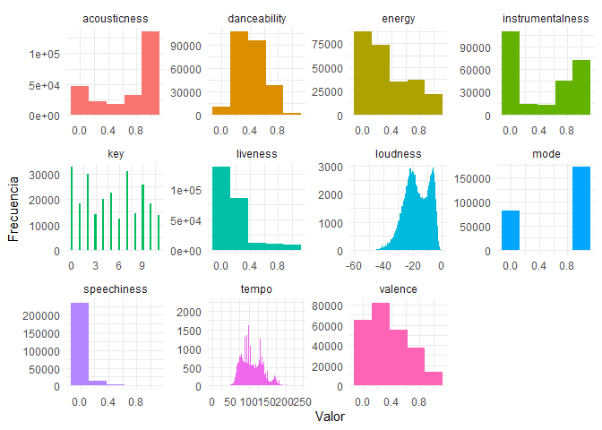
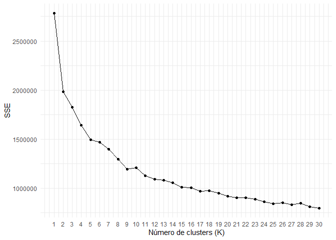

Spotify - Recomendación de Playlist
================

# 1. Introducción

### 1.1 Análisis de música

El objetivo de esta tarea es ver cómo abordan un problema de la vida
real, con incertidumbre, ya que en el mundo profesional se enfrentarán
con tareas similares.

### 1.2 Descripción del problema

Spotify recomienda nuevas canciones a sus usuarios basándose en las
reproducciones pasadas y en estilos musicales similares. Esto lo hace a
través de diversos algoritmos que relacionan las canciones a través de
diferentes atributos como la verbosidad o energía. Una lista con las
mediciones que se hace para cada canción esta disponible en la
documentación de la API de
Spotify(<https://developer.spotify.com/documentation/web-api/reference/>).

El objetivo principal de este encargo es crear un programa computacional
que permita crear una lista de reproducción de 3 horas de duración
basándose en alguna canción de referencia. La base de datos incluye
447.622 canciones, con 36 de las variables descritas en la documentación
de la API.

Como resultado de la prueba, genere un reporte en RMarkdown describiendo
las etapas de su proceso, los modelos de clustering utilizados, los
resultados obtenidos y el código empleado. Debe explicar cómo limpió los
datos, como se eligieron y generaron las variables, y como construyó su
lógica.

### 1.3 Metodología utilizada

Se estudiarán las características de audio de las distintas canciones
con el objetivo de realizar análisis de agrupaciones para ofrecer
recomendaciones que sean similares a la canción de referencia utilizada.

# 2. Paquetes requeridos

``` r
library(tidyverse)
library(corrplot)
library(factoextra)
```

### 2.1 Información de paquetes utilizados

**tidyverse** - Permite la manipulación, importación, exploración y
visualización de datos. Contiene los paquetes readr, dplyr, ggplot2,
tibble, tidyr, purr, stringr y forcats.

**corrplot** - Visualización de correlación entre variables.

**factoextra** - PENDIENTE.

# 3. Preparación de los datos

### 3.1 Fuente

Se utilizará el archivo “beats.RData” que contiene 447.622 canciones con
36 variables cada una.

Datos extraídos de la API de Spotify.

``` r
load('beats.RData')
beats <- beats
```

    ## El dataframe contiene 447622 filas y 36 columnas.

### 3.2 Información

Nombre de columna, tipo de dato y registro de la columna.

``` r
glimpse(beats)
```

    ## Rows: 447,622
    ## Columns: 36
    ## $ artist_name                  <chr> "2Pac", "2Pac", "2Pac", "2Pac", "2Pac", "…
    ## $ artist_id                    <chr> "1ZwdS5xdxEREPySFridCfh", "1ZwdS5xdxEREPy…
    ## $ album_id                     <chr> "1nGbXgS6toEOcFCDwEl5R3", "1nGbXgS6toEOcF…
    ## $ album_type                   <chr> "album", "album", "album", "album", "albu…
    ## $ album_release_date           <chr> "2019-08-01", "2019-08-01", "2019-08-01",…
    ## $ album_release_year           <dbl> 2019, 2019, 2019, 2019, 2019, 2019, 2019,…
    ## $ album_release_date_precision <chr> "day", "day", "day", "day", "day", "day",…
    ## $ danceability                 <dbl> 0.656, 0.810, 0.548, 0.839, 0.854, 0.697,…
    ## $ energy                       <dbl> 0.882, 0.642, 0.590, 0.657, 0.694, 0.598,…
    ## $ key                          <int> 0, 8, 4, 5, 0, 2, 1, 11, 11, 7, 5, 8, 11,…
    ## $ loudness                     <dbl> -3.011, -8.647, -9.301, -4.959, -4.258, -…
    ## $ mode                         <int> 1, 1, 0, 0, 0, 1, 0, 0, 1, 1, 0, 1, 0, 1,…
    ## $ speechiness                  <dbl> 0.0941, 0.2440, 0.4750, 0.2220, 0.1230, 0…
    ## $ acousticness                 <dbl> 0.03300, 0.04800, 0.11300, 0.05260, 0.009…
    ## $ instrumentalness             <dbl> 0.00e+00, 0.00e+00, 7.22e-04, 1.06e-04, 7…
    ## $ liveness                     <dbl> 0.6700, 0.2640, 0.2290, 0.3910, 0.0767, 0…
    ## $ valence                      <dbl> 0.782, 0.694, 0.267, 0.615, 0.776, 0.387,…
    ## $ tempo                        <dbl> 91.661, 90.956, 87.841, 85.111, 104.379, …
    ## $ track_id                     <chr> "6ayeqYtOtwVhqVB6k6MKoh", "1UDsnzBp8gUCFs…
    ## $ analysis_url                 <chr> "https://api.spotify.com/v1/audio-analysi…
    ## $ time_signature               <int> 4, 4, 4, 4, 4, 4, 4, 4, 4, 4, 4, 4, 4, 4,…
    ## $ disc_number                  <int> 1, 1, 1, 1, 1, 1, 1, 1, 1, 1, 1, 1, 1, 1,…
    ## $ duration_ms                  <int> 347973, 241026, 240013, 295026, 241000, 2…
    ## $ explicit                     <lgl> FALSE, FALSE, FALSE, FALSE, FALSE, FALSE,…
    ## $ track_href                   <chr> "https://api.spotify.com/v1/tracks/6ayeqY…
    ## $ is_local                     <lgl> FALSE, FALSE, FALSE, FALSE, FALSE, FALSE,…
    ## $ track_name                   <chr> "California Love", "Slippin' Into Darknes…
    ## $ track_preview_url            <chr> "https://p.scdn.co/mp3-preview/93e456ef0b…
    ## $ track_number                 <int> 1, 2, 3, 4, 5, 6, 7, 8, 9, 10, 11, 12, 13…
    ## $ type                         <chr> "track", "track", "track", "track", "trac…
    ## $ track_uri                    <chr> "spotify:track:6ayeqYtOtwVhqVB6k6MKoh", "…
    ## $ external_urls.spotify        <chr> "https://open.spotify.com/track/6ayeqYtOt…
    ## $ album_name                   <chr> "California Love", "California Love", "Ca…
    ## $ key_name                     <chr> "C", "G#", "E", "F", "C", "D", "C#", "B",…
    ## $ mode_name                    <chr> "major", "major", "minor", "minor", "mino…
    ## $ key_mode                     <chr> "C major", "G# major", "E minor", "F mino…

### 3.2 Limpieza

#### 3.2.1 Removiendo duplicados

Se remueven las canciones duplicadas.

``` r
beats <- beats[!duplicated(beats$track_id),]
```

``` r
beats <- subset(beats, !duplicated(beats[, c(8:18)]))
beats <- subset(beats, !duplicated(beats[, c("artist_name","track_name","album_name")]))
```

#### 3.2.2 Creando variables

Se crea la variable que mide la duración de la canción en minutos.

``` r
beats$duration_min <- beats$duration_ms / 60000
```

#### 3.2.3 Removiendo variables

Para el análisis que se busca, se necesitan las características de
sonido de la canción, su duración y su nombre.

Solo se conservaran estas variables y se removerá el resto.

``` r
beats <- beats %>% select(c(artist_name,track_name,duration_min,8:18))
```

#### 3.2.4 Removiendo NA’s

Se observa que las variables seleccionadas están limpias y no presentan
NA´s.

No es necesario realizar limpieza.

``` r
colSums(is.na(beats))
```

    ##      artist_name       track_name     duration_min     danceability 
    ##                0                0                0                0 
    ##           energy              key         loudness             mode 
    ##                0                0                0                0 
    ##      speechiness     acousticness instrumentalness         liveness 
    ##                0                0                0                0 
    ##          valence            tempo 
    ##                0                0

#### 3.2.5 Tamaño final del archivo

    ## El dataframe contiene 252842 filas y 14 columnas.

### 3.3 Descripción de los atributos

Cada canción presente en la base de datos contiene los siguientes
atributos:

**artist_name** - Nombre del artista

**track_name** - Nombre de la canción.

**duration_min** - Duración en minutos.

**danceability** - Qué tan bailable es la canción, donde 0,0 es el menor
y 1,0 es el mayor.

**energy** - Que tanta intensidad y actividad representa, donde 0,0 es
el menor y 1,0 es el mayor.

**key** - Clave de la pista. 0 es Do, 1 es Do#, 2 es Re y así
sucesivamente. Cuando no presenta tonalidad es -1.

**loudness** - Qué tanto decibelios (dB) tiene la canción. Oscila entre
-60 y 0 dB.

**mode** - Contenido melódico de la canción. Mayor es 1 y Menor es 0.

**speechiness** - Presencia de palabras habladas. 1 es el mayor y 0 es
el menor.

**acousticness** - Acústica de la canción. 1 es acústica y 0 es no
acústica.

**instrumentalness** - Presencia de voces. 1 es instrumento y 0 es voz.

**liveness** - Detecta público en la grabación. Mayor valor es alta
presencia de público.

**valence** - Positividad de la canción. 1 es alegre y 0 es triste.

**tempo** - Pulsaciones por minuto (BPM).

# 4. Análisis exploratorio de datos (EDA)

### 4.1 Mapa de correlación

Se utiliza el coeficiente de correlación de Pearson, que mide la
correlación lineal entre dos variables continuas que varía entre -1 y 1,
donde 1 indica una correlación positiva perfecta y -1 indica una
correlación negativa perfecta, siendo 0 la falta de correlación lineal.

$$\rho = \frac{\text{cov}(X,Y)}{\sigma_x \sigma_y}$$

``` r
beats_atributos <- select(beats, 4:14)
corrplot(cor(beats_atributos))
```

<!-- -->

En el gráfico se visualiza que las variables que se utilizaran en el
gráfico están fuertemente correlacionadas, a excepción de key y mode,
que son valores enteros y no se encuentra una relación ni positiva ni
negativa con el resto de variables.

En cambio, tomando como ejemplo la variable danceability. Esta se
relaciona positivamente con loudness y valence. Resultado lógico por lo
que representa cada variable, esperando que una canción con alto dB y
positividad genere un ambiente de deseos de bailar.

La variable energy presenta una correlación positiva con loudness y
liveness, mientras que una correlación débil con acousticness. Esto
porque las canciones con alta intensidad presentan un sonido más fuerte
(dB), donde también podría contener público en la grabación. La variable
acousticness se encuentra en canciones más tranquilas y sin tanta
intensidad, por lo que es lógico que tendrá una correlación débil.

### 4.2 Histograma

Se visualiza la forma de distribución, el rango y la concentración de
los datos.

``` r
beats_grafico <- beats_atributos %>% tidyr::gather(key = "variable", value = "valor")

ggplot(beats_grafico, aes(x = valor, fill = variable)) +
  geom_histogram(binwidth=0.25) +
  facet_wrap(~ variable, scales = "free") +
  scale_fill_hue() +
  guides(fill = "none") +
  theme(legend.position = "none") +
  labs(x = "Valor", y = "Frecuencia") +
  theme_minimal()
```

<!-- -->

Se identifican concentraciones importantes en las variables, infiriendo
que existen subgrupos dentro de los datos. Esto podría reflejarse en la
presencia de categorías o generos de músicas.

### 4.3 Boxplot

Resumen estadísticos de los datos, identificando la medianta, cuartiles
y valores atípicos.Permite identificar la simetría de la distribución y
la variabilidad.

``` r
ggplot(beats_grafico, aes(x = variable, y = valor)) +
  geom_boxplot(aes(fill = variable)) +
  facet_wrap(~ variable, scales = "free") +
  scale_fill_hue() +
  guides(fill = "none") +
  theme(legend.position = "none") +
  labs(x = "Variable", y = "Valor") +
  theme_minimal()
```

<!-- -->

Se identifican datos atípicos en los valores extremos que pueden tener
un impacto significativo en el análisis de datos.

Para dar una explicación a los datos atípicos que se visualizan, se
necesita una nueva variable llamada “genero” que podría ser la
explicación de la concentración de datos en ciertos valores.

También es necesario conocer la variabilidad y dispersión de la variable
“genero”, ya que la muestra de datos podría concentrarse en solo un
pequeño grupo de generos y el resto de canciones que pertenecen a un
genero distinto representen los datos atípicos en las variables
analizadas.

# 5. Construcción del modelo

### 5.1 Escalar datos

Debido a que cada variable tiene su escala única y no pueden medirse de
la misma manera, se deberán escalar los datos.

Se realiza una estandarización de datos, dejando la media = 0 y la
desviación estandar = 1 para todas las variables.

$$X_{scaled} = \frac{(x - \bar{x})^2}{\sigma}$$

A continuación, se muestra un resumen estadístico de las variables antes
y después de ser escaladas.

``` r
summary(beats_atributos)
```

    ##   danceability        energy            key            loudness      
    ##  Min.   :0.0000   Min.   :0.0000   Min.   : 0.000   Min.   :-60.000  
    ##  1st Qu.:0.2750   1st Qu.:0.0817   1st Qu.: 2.000   1st Qu.:-23.248  
    ##  Median :0.3930   Median :0.2210   Median : 5.000   Median :-17.401  
    ##  Mean   :0.4151   Mean   :0.3395   Mean   : 5.079   Mean   :-17.085  
    ##  3rd Qu.:0.5450   3rd Qu.:0.5800   3rd Qu.: 8.000   3rd Qu.: -9.333  
    ##  Max.   :0.9860   Max.   :1.0000   Max.   :11.000   Max.   :  0.496  
    ##       mode        speechiness       acousticness    instrumentalness  
    ##  Min.   :0.000   Min.   :0.00000   Min.   :0.0000   Min.   :0.000000  
    ##  1st Qu.:0.000   1st Qu.:0.03680   1st Qu.:0.3080   1st Qu.:0.000234  
    ##  Median :1.000   Median :0.04300   Median :0.9090   Median :0.451000  
    ##  Mean   :0.677   Mean   :0.06827   Mean   :0.6776   Mean   :0.447022  
    ##  3rd Qu.:1.000   3rd Qu.:0.05510   3rd Qu.:0.9840   3rd Qu.:0.887000  
    ##  Max.   :1.000   Max.   :0.97100   Max.   :0.9960   Max.   :1.000000  
    ##     liveness         valence           tempo       
    ##  Min.   :0.0000   Min.   :0.0000   Min.   :  0.00  
    ##  1st Qu.:0.0946   1st Qu.:0.1210   1st Qu.: 84.69  
    ##  Median :0.1190   Median :0.3070   Median :108.03  
    ##  Mean   :0.2045   Mean   :0.3613   Mean   :110.50  
    ##  3rd Qu.:0.2150   3rd Qu.:0.5600   3rd Qu.:132.03  
    ##  Max.   :1.0000   Max.   :0.9960   Max.   :244.95

``` r
beats_escalar <- scale(beats_atributos) %>% as_tibble()
summary(beats_escalar)
```

    ##   danceability         energy             key             loudness       
    ##  Min.   :-2.2145   Min.   :-1.1115   Min.   :-1.4545   Min.   :-4.97278  
    ##  1st Qu.:-0.7475   1st Qu.:-0.8440   1st Qu.:-0.8818   1st Qu.:-0.71413  
    ##  Median :-0.1180   Median :-0.3879   Median :-0.0227   Median :-0.03661  
    ##  Mean   : 0.0000   Mean   : 0.0000   Mean   : 0.0000   Mean   : 0.00000  
    ##  3rd Qu.: 0.6929   3rd Qu.: 0.7875   3rd Qu.: 0.8364   3rd Qu.: 0.89827  
    ##  Max.   : 3.0455   Max.   : 2.1626   Max.   : 1.6954   Max.   : 2.03721  
    ##       mode          speechiness       acousticness     instrumentalness  
    ##  Min.   :-1.4478   Min.   :-0.6611   Min.   :-1.7798   Min.   :-1.07533  
    ##  1st Qu.:-1.4478   1st Qu.:-0.3047   1st Qu.:-0.9708   1st Qu.:-1.07477  
    ##  Median : 0.6907   Median :-0.2447   Median : 0.6079   Median : 0.00957  
    ##  Mean   : 0.0000   Mean   : 0.0000   Mean   : 0.0000   Mean   : 0.00000  
    ##  3rd Qu.: 0.6907   3rd Qu.:-0.1275   3rd Qu.: 0.8049   3rd Qu.: 1.05839  
    ##  Max.   : 0.6907   Max.   : 8.7412   Max.   : 0.8364   Max.   : 1.33022  
    ##     liveness           valence            tempo         
    ##  Min.   :-0.99871   Min.   :-1.3332   Min.   :-3.52293  
    ##  1st Qu.:-0.53682   1st Qu.:-0.8867   1st Qu.:-0.82288  
    ##  Median :-0.41768   Median :-0.2005   Median :-0.07888  
    ##  Mean   : 0.00000   Mean   : 0.0000   Mean   : 0.00000  
    ##  3rd Qu.: 0.05105   3rd Qu.: 0.7330   3rd Qu.: 0.68612  
    ##  Max.   : 3.88392   Max.   : 2.3418   Max.   : 4.28625

### 5.2 Método del codo (Elbow method)

Se utiliza el método del codo para realizar un análisis de clusters
(agrupamiento) para determinar el número óptimo de grupos en un conjunto
de datos.

El objetivo es encontrar el punto en el que la adición de más clusters
no proporcione una mejora significativa en la calidad del agrupamiento.

Esto se define como la suma de errores cuadráticos (SSE), que representa
la sumatoria de la diferencia de las distancias al cuadrado de cada
punto de datos dentro de su cluster correspondiente. Esto mide la
variación total dentro de los clusters.

$$SSE = \sum (y_{variable} - y_{cluster})^2$$

Para identificar el “codo”, se busca que la adición de más clusters ya
no reduzca significativamente el SSE. Esto suele representar un
equilibrio entre una buena división de los datos en grupos coherentes y
evitar una división excesiva que puede conducir a un sobreajuste.

``` r
# Calcular SSE para diferentes valores de K
k_values <- 1:30
sse_values <- c()
for (k in k_values) {
  kmeans_model <- kmeans(beats_escalar, centers = k)
  sse_values <- c(sse_values, kmeans_model$tot.withinss)
}

# Calcular la variación entre SSE actual y anterior
sse_variation <- c(0, diff(sse_values))

# Calcular la variación porcentual
sse_percent_variation <- (sse_variation / sse_values) * 100

# Crear un data frame con los valores de K, SSE, la variación y la variación porcentual
df <- data.frame(K = k_values, SSE = sse_values, Variation = sse_variation, Percent_Variation = sse_percent_variation)

# Graficar la curva SSE vs K
ggplot(df, aes(x = K, y = SSE)) +
  geom_line() +
  geom_point() +
  labs(x = "Número de clusters (K)", y = "SSE") +
  theme_minimal() +
  scale_x_continuous(breaks = k_values)
```

<!-- -->

``` r
# Imprimir los valores SSE con sus respectivos clusters, la variación y la variación porcentual
cat("K\tSSE\t\tVariación\tVariación Porcentual\n")
```

    ## K    SSE     Variación   Variación Porcentual

``` r
for (i in 1:length(k_values)) {
  cat(k_values[i], "\t", sse_values[i], "\t", sse_variation[i], "\t", sse_percent_variation[i], "\n")
}
```

    ## 1     2781251     0   0 
    ## 2     1981557     -799693.7   -40.35683 
    ## 3     1827644     -153913.6   -8.421422 
    ## 4     1642724     -184920     -11.25691 
    ## 5     1494508     -148215.8   -9.917364 
    ## 6     1470156     -24351.59   -1.656395 
    ## 7     1396795     -73361.41   -5.252125 
    ## 8     1294453     -102342.2   -7.906215 
    ## 9     1192924     -101528.7   -8.51091 
    ## 10    1207953     15028.76    1.244151 
    ## 11    1129183     -78770.09   -6.97585 
    ## 12    1093113     -36069.73   -3.299725 
    ## 13    1080309     -12804.02   -1.185218 
    ## 14    1056127     -24181.5    -2.289638 
    ## 15    1011091     -45036.67   -4.454266 
    ## 16    1007496     -3595.191   -0.3568444 
    ## 17    972229.2    -35266.41   -3.627376 
    ## 18    973165.5    936.2346    0.09620508 
    ## 19    951898.6    -21266.89   -2.234155 
    ## 20    921385.8    -30512.72   -3.311612 
    ## 21    903160.7    -18225.2    -2.017935 
    ## 22    903566.6    405.9278    0.04492506 
    ## 23    889508.7    -14057.92   -1.580415 
    ## 24    864106.4    -25402.29   -2.939718 
    ## 25    844667.1    -19439.29   -2.301414 
    ## 26    851593.8    6926.752    0.8133868 
    ## 27    835146      -16447.87   -1.96946 
    ## 28    847321.9    12175.93    1.43699 
    ## 29    810831      -36490.91   -4.500433 
    ## 30    799510.2    -11320.8    -1.415966

Se define K=12 como el punto de inflexión, donde la disminución del SSE
se vuelve menos pronunciada. Es decir, la variación porcentual del SSE
no es significativa (\<5%).

A continuación, se muestra el número de observaciones para cada cluster
y el valor de sus centroides (media de todas sus observaciones).

``` r
beats_escalar_kmeans <- kmeans(beats_escalar, centers = 12)
beats_escalar_kmeans$size
```

    ##  [1] 28629 23034 14809 26120 38445 18587 25176 23229 18446 14864  4072 17431

Se almacena el centroide del cluster como variable para los registros.

``` r
beats_escalar$cluster <- as.numeric(beats_escalar_kmeans$cluster)
beats$cluster <- as.numeric(beats_escalar_kmeans$cluster)
```

Calculamos el estadístico de Hopkins

``` r
get_clust_tendency(beats_escalar, n = 12, graph = FALSE)
```

    ## $hopkins_stat
    ## [1] 0.8951725
    ## 
    ## $plot
    ## NULL

Coeficiente de silueta

``` r
beats_escalar_kmeans$tot.withinss
```

    ## [1] 1098926

``` r
beats_escalar_kmeans$totss
```

    ## [1] 2781251

``` r
beats_escalar_kmeans$betweenss
```

    ## [1] 1682325

``` r
((beats_escalar_kmeans$betweenss)/(beats_escalar_kmeans$totss))*100
```

    ## [1] 60.48807

``` r
beats_escalar %>% 
  group_by(cluster) %>% 
  summarise_all(mean) %>% 
  select(cluster, danceability,energy,key, loudness, mode, speechiness, acousticness, instrumentalness,liveness, valence, tempo)
```

    ## # A tibble: 12 × 12
    ##    cluster danceability energy       key loudness     mode speechiness
    ##      <dbl>        <dbl>  <dbl>     <dbl>    <dbl>    <dbl>       <dbl>
    ##  1       1      -0.723  -0.740  0.000858  -0.811  -1.45        -0.230 
    ##  2       2      -0.751  -0.782  0.922     -0.822   0.689       -0.232 
    ##  3       3      -0.0613 -0.388  0.167     -0.0285 -1.45        -0.134 
    ##  4       4       0.259  -0.246 -0.120      0.253   0.691       -0.136 
    ##  5       5       0.889   1.25  -0.0790     1.12    0.691        0.0160
    ##  6       6      -0.433  -0.656 -0.887     -0.583   0.573       -0.206 
    ##  7       7      -0.883  -0.795 -0.860     -0.885   0.689       -0.232 
    ##  8       8       0.923   1.27   0.319      1.11   -1.45         0.0917
    ##  9       9       0.463  -0.341 -0.135     -0.325   0.00242     -0.182 
    ## 10      10      -0.445  -0.669  0.972     -0.607   0.489       -0.199 
    ## 11      11       1.15   -0.120  0.160     -0.198  -0.00252      6.63  
    ## 12      12       0.0125  1.30   0.0315     0.915   0.0423       0.213 
    ## # ℹ 5 more variables: acousticness <dbl>, instrumentalness <dbl>,
    ## #   liveness <dbl>, valence <dbl>, tempo <dbl>

``` r
beats %>% 
  filter(track_name == "Runnin'", artist_name == "2Pac")
```

    ##   artist_name track_name duration_min danceability energy key loudness mode
    ## 1        2Pac    Runnin'     3.733767        0.697  0.598   2   -9.604    1
    ##   speechiness acousticness instrumentalness liveness valence  tempo cluster
    ## 1       0.136      0.00522                0    0.172   0.387 85.862       5

``` r
beats %>% 
  filter(cluster == 3) %>% 
  sample_n(5)
```

    ##               artist_name
    ## 1   Johann Sebastian Bach
    ## 2 Wolfgang Amadeus Mozart
    ## 3     Sergei Rachmaninoff
    ## 4 Wolfgang Amadeus Mozart
    ## 5                 America
    ##                                                                          track_name
    ## 1    St. Matthew Passion, BWV 244, Pt. 2: No. 67. Nun ist der Herr zur Ruh gebracht
    ## 2 Six Preludes and Fugues, K.404a: Fugue V (from Bach's Organsonata No. 2, BWV 526)
    ## 3                                             Twelve Songs, Op.14: 1. Ya zhdu tebya
    ## 4                                      Violin Concerto No.3 in G, K.216: 1. Allegro
    ## 5                                                       Till the Sun Comes up Again
    ##   duration_min danceability energy key loudness mode speechiness acousticness
    ## 1     1.714883        0.232  0.101   4  -20.827    0      0.0396        0.955
    ## 2     4.771767        0.451  0.367   0  -11.423    0      0.0540        0.981
    ## 3     2.005550        0.341  0.194   5  -16.230    0      0.0607        0.991
    ## 4     9.198433        0.471  0.178  11  -16.625    0      0.0398        0.964
    ## 5     2.210667        0.463  0.251   7  -15.240    0      0.0293        0.748
    ##   instrumentalness liveness valence   tempo cluster
    ## 1         8.91e-02   0.1110  0.0399  82.610       3
    ## 2         1.98e-01   0.1570  0.7880 149.447       3
    ## 3         9.67e-06   0.1370  0.0558  86.447       3
    ## 4         4.24e-01   0.0776  0.3000 121.567       3
    ## 5         1.00e-05   0.1190  0.4540 103.775       3

``` r
playlist_oficial <- NULL
durationplaylist_in <- 0
durationplaylist_fin <- 180


while ( durationplaylist_in < durationplaylist_fin) {
  
  for(i in nrow(beats)) {
    durationplaylist_in <- durationplaylist_in
    

    song <- beats[i,"track_name"]
    durationsong <- beats[i,"duration_min"]
    print(song)
    print(durationsong)
    
    
    
    if(durationplaylist_in < durationplaylist_fin) {
      
      
      playlist_oficial <- rbind(playlist_oficial, beats[i,])
      durationplaylist_in <- durationplaylist_in + durationsong
      beats <- beats[-i,]
      
    }  
      
    
    print(durationplaylist_in)
  }

}
```

    ## [1] "Backdoor Love Affair"
    ## [1] 3.331767
    ## [1] 3.331767
    ## [1] "Just Got Back from Baby's"
    ## [1] 4.168667
    ## [1] 7.500433
    ## [1] "Bedroom Thang"
    ## [1] 4.664
    ## [1] 12.16443
    ## [1] "Certified Blues"
    ## [1] 3.461767
    ## [1] 15.6262
    ## [1] "Neighbor, Neighbor"
    ## [1] 2.354
    ## [1] 17.9802
    ## [1] "Old Man"
    ## [1] 3.453333
    ## [1] 21.43353
    ## [1] "Goin' Down to Mexico"
    ## [1] 3.39355
    ## [1] 24.82708
    ## [1] "Squank"
    ## [1] 2.810883
    ## [1] 27.63797
    ## [1] "Brown Sugar"
    ## [1] 5.409333
    ## [1] 33.0473
    ## [1] "(Somebody Else Been) Shaking Your Tree"
    ## [1] 2.58555
    ## [1] 35.63285
    ## [1] "Down Brownie"
    ## [1] 2.502433
    ## [1] 38.13528
    ## [1] "Whiskey'n Mama"
    ## [1] 3.342433
    ## [1] 41.47772
    ## [1] "Sure Got Cold After the Rain Fell"
    ## [1] 7.3491
    ## [1] 48.82682
    ## [1] "Bar-B-Q"
    ## [1] 3.432883
    ## [1] 52.2597
    ## [1] "Apologies to Pearly"
    ## [1] 2.660433
    ## [1] 54.92013
    ## [1] "Chevrolet"
    ## [1] 3.351767
    ## [1] 58.2719
    ## [1] "Ko Ko Blue"
    ## [1] 4.54355
    ## [1] 62.81545
    ## [1] "Mushmouth Shoutin'"
    ## [1] 3.816433
    ## [1] 66.63188
    ## [1] "Just Got Paid"
    ## [1] 4.458
    ## [1] 71.08988
    ## [1] "Francine"
    ## [1] 3.56
    ## [1] 74.64988
    ## [1] "Asleep in the Desert - Instrumental"
    ## [1] 3.493767
    ## [1] 78.14365
    ## [1] "She's a Heartbreaker"
    ## [1] 3.049767
    ## [1] 81.19342
    ## [1] "Avalon Hideaway"
    ## [1] 3.132217
    ## [1] 84.32563
    ## [1] "Pan Am Highway Blues"
    ## [1] 3.256217
    ## [1] 87.58185
    ## [1] "Ten Dollar Man"
    ## [1] 3.686
    ## [1] 91.26785
    ## [1] "Enjoy and Get It On"
    ## [1] 3.41755
    ## [1] 94.6854
    ## [1] "Snappy Kakkie"
    ## [1] 2.970883
    ## [1] 97.65628
    ## [1] "El Diablo"
    ## [1] 4.35755
    ## [1] 102.0138
    ## [1] "Arrested for Driving While Blind"
    ## [1] 3.109767
    ## [1] 105.1236
    ## [1] "It's Only Love"
    ## [1] 4.393767
    ## [1] 109.5174
    ## [1] "Esther Be the One"
    ## [1] 3.5111
    ## [1] 113.0285
    ## [1] "Cheap Sunglasses"
    ## [1] 4.806667
    ## [1] 117.8351
    ## [1] "Hi Fi Mama"
    ## [1] 2.39155
    ## [1] 120.2267
    ## [1] "Lowdown in the Street"
    ## [1] 2.82
    ## [1] 123.0467
    ## [1] "Dust My Broom"
    ## [1] 3.120667
    ## [1] 126.1674
    ## [1] "Manic Mechanic"
    ## [1] 2.592217
    ## [1] 128.7596
    ## [1] "A Fool for Your Stockings"
    ## [1] 4.234883
    ## [1] 132.9945
    ## [1] "I'm Bad, I'm Nationwide"
    ## [1] 4.776217
    ## [1] 137.7707
    ## [1] "She Loves My Automobile"
    ## [1] 2.3851
    ## [1] 140.1558
    ## [1] "I Thank You"
    ## [1] 3.402217
    ## [1] 143.558
    ## [1] "Tush - Live"
    ## [1] 3.6611
    ## [1] 147.2191
    ## [1] "Jailhouse Rock - Live"
    ## [1] 1.803333
    ## [1] 149.0224
    ## [1] "Dust My Broom - Live"
    ## [1] 3.37755
    ## [1] 152.4
    ## [1] "La Grange / Sloppy Drunk / Bar-B-Q - Live"
    ## [1] 8.144883
    ## [1] 160.5449
    ## [1] "Beer Drinkers & Hell Raisers - Live"
    ## [1] 3.060217
    ## [1] 163.6051
    ## [1] "Arrested For Driving While Blind - Live"
    ## [1] 4.692
    ## [1] 168.2971
    ## [1] "Cheap Sunglasses - Live"
    ## [1] 4.352
    ## [1] 172.6491
    ## [1] "Fool For Your Stockings - Live"
    ## [1] 5.855333
    ## [1] 178.5044
    ## [1] "Heard It On The X - Live"
    ## [1] 2.471767
    ## [1] 180.9762

### 5.3 visual

# 6. Evaluación del modelo

### 6.1 visual

### 6.2 visual
