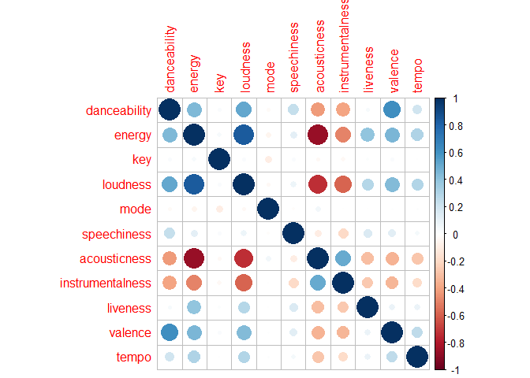

Spotify - Recomendación de Playlist
================
Cristián Daniel Villanueva Massardo
27 de mayo de 2023

# 1. Introducción

### 1.1 Análisis de música

El objetivo de esta tarea es ver cómo abordan un problema de la vida
real, con incertidumbre, ya que en el mundo profesional se enfrentarán
con tareas similares.

### 1.2 Descripción del problema

Spotify recomienda nuevas canciones a sus usuarios basándose en las
reproducciones pasadas y en estilos musicales similares. Esto lo hace a
través de diversos algoritmos que relacionan las canciones a través de
diferentes atributos como la verbosidad o energía. Una lista con las
mediciones que se hace para cada canción esta disponible en la
documentación de la API de
Spotify(<https://developer.spotify.com/documentation/web-api/reference/>).

El objetivo principal de este encargo es crear un programa computacional
que permita crear una lista de reproducción de 3 horas de duración
basándose en alguna canción de referencia. La base de datos incluye
447.622 canciones, con 36 de las variables descritas en la documentación
de la API.

Como resultado de la prueba, genere un reporte en RMarkdown describiendo
las etapas de su proceso, los modelos de clustering utilizados, los
resultados obtenidos y el código empleado. Debe explicar cómo limpió los
datos, como se eligieron y generaron las variables, y como construyó su
lógica.

### 1.3 Metodología utilizada

Se estudiarán las características de audio de las distintas canciones
con el objetivo de realizar análisis de agrupaciones para ofrecer
recomendaciones que sean similares a la canción de referencia utilizada.
Se intentará comprobar si existe algún patrón para clusterizar y en qué
se diferencia cada cluster.

# 2. Paquetes requeridos

``` r
library(tidyverse)
library(corrplot)
library(factoextra)
```

### 2.1 Información de paquetes utilizados

**tidyverse** - Permite la manipulación, importación, exploración y
visualización de datos. Contiene los paquetes readr, dplyr, ggplot2,
tibble, tidyr, purr, stringr y forcats.

**corrplot** - Visualización de correlación entre variables.

# 3. Preparación de los datos

### 3.1 Fuente

Se utilizará el archivo “beats.RData” que contiene 447.622 canciones con
36 variables cada una.

Datos extraídos de la API de Spotify.

``` r
load('beats.RData')
beats <- beats
```

    ## El dataframe contiene 447622 filas y 36 columnas.

### 3.2 Información

Nombre de columna, tipo de dato y registro de la columna.

``` r
glimpse(beats)
```

    ## Rows: 447,622
    ## Columns: 36
    ## $ artist_name                  <chr> "2Pac", "2Pac", "2Pac", "2Pac", "2Pac", "…
    ## $ artist_id                    <chr> "1ZwdS5xdxEREPySFridCfh", "1ZwdS5xdxEREPy…
    ## $ album_id                     <chr> "1nGbXgS6toEOcFCDwEl5R3", "1nGbXgS6toEOcF…
    ## $ album_type                   <chr> "album", "album", "album", "album", "albu…
    ## $ album_release_date           <chr> "2019-08-01", "2019-08-01", "2019-08-01",…
    ## $ album_release_year           <dbl> 2019, 2019, 2019, 2019, 2019, 2019, 2019,…
    ## $ album_release_date_precision <chr> "day", "day", "day", "day", "day", "day",…
    ## $ danceability                 <dbl> 0.656, 0.810, 0.548, 0.839, 0.854, 0.697,…
    ## $ energy                       <dbl> 0.882, 0.642, 0.590, 0.657, 0.694, 0.598,…
    ## $ key                          <int> 0, 8, 4, 5, 0, 2, 1, 11, 11, 7, 5, 8, 11,…
    ## $ loudness                     <dbl> -3.011, -8.647, -9.301, -4.959, -4.258, -…
    ## $ mode                         <int> 1, 1, 0, 0, 0, 1, 0, 0, 1, 1, 0, 1, 0, 1,…
    ## $ speechiness                  <dbl> 0.0941, 0.2440, 0.4750, 0.2220, 0.1230, 0…
    ## $ acousticness                 <dbl> 0.03300, 0.04800, 0.11300, 0.05260, 0.009…
    ## $ instrumentalness             <dbl> 0.00e+00, 0.00e+00, 7.22e-04, 1.06e-04, 7…
    ## $ liveness                     <dbl> 0.6700, 0.2640, 0.2290, 0.3910, 0.0767, 0…
    ## $ valence                      <dbl> 0.782, 0.694, 0.267, 0.615, 0.776, 0.387,…
    ## $ tempo                        <dbl> 91.661, 90.956, 87.841, 85.111, 104.379, …
    ## $ track_id                     <chr> "6ayeqYtOtwVhqVB6k6MKoh", "1UDsnzBp8gUCFs…
    ## $ analysis_url                 <chr> "https://api.spotify.com/v1/audio-analysi…
    ## $ time_signature               <int> 4, 4, 4, 4, 4, 4, 4, 4, 4, 4, 4, 4, 4, 4,…
    ## $ disc_number                  <int> 1, 1, 1, 1, 1, 1, 1, 1, 1, 1, 1, 1, 1, 1,…
    ## $ duration_ms                  <int> 347973, 241026, 240013, 295026, 241000, 2…
    ## $ explicit                     <lgl> FALSE, FALSE, FALSE, FALSE, FALSE, FALSE,…
    ## $ track_href                   <chr> "https://api.spotify.com/v1/tracks/6ayeqY…
    ## $ is_local                     <lgl> FALSE, FALSE, FALSE, FALSE, FALSE, FALSE,…
    ## $ track_name                   <chr> "California Love", "Slippin' Into Darknes…
    ## $ track_preview_url            <chr> "https://p.scdn.co/mp3-preview/93e456ef0b…
    ## $ track_number                 <int> 1, 2, 3, 4, 5, 6, 7, 8, 9, 10, 11, 12, 13…
    ## $ type                         <chr> "track", "track", "track", "track", "trac…
    ## $ track_uri                    <chr> "spotify:track:6ayeqYtOtwVhqVB6k6MKoh", "…
    ## $ external_urls.spotify        <chr> "https://open.spotify.com/track/6ayeqYtOt…
    ## $ album_name                   <chr> "California Love", "California Love", "Ca…
    ## $ key_name                     <chr> "C", "G#", "E", "F", "C", "D", "C#", "B",…
    ## $ mode_name                    <chr> "major", "major", "minor", "minor", "mino…
    ## $ key_mode                     <chr> "C major", "G# major", "E minor", "F mino…

### 3.2 Limpieza

#### 3.2.1 Removiendo duplicados

Se remueven las canciones duplicadas.

``` r
beats <- beats[!duplicated(beats$track_id),]
```

#### 3.2.2 Creando variables

Se crea la variable que mide la duración de la canción en minutos.

``` r
beats$duration_min <- beats$duration_ms / 60000
```

#### 3.2.3 Removiendo variables

Para el análisis que se busca, se necesitan las características de
sonido de la canción, su duración y su nombre.

Solo se conservaran estas variables y se removerá el resto.

``` r
beats <- beats %>% select(c(track_name,duration_min,8:18))
```

#### 3.2.4 Removiendo NA’s

Se observa que las variables seleccionadas están limpias y no presentan
NA´s.

No es necesario realizar limpieza.

``` r
colSums(is.na(beats))
```

    ##       track_name     duration_min     danceability           energy 
    ##                0                0                0                0 
    ##              key         loudness             mode      speechiness 
    ##                0                0                0                0 
    ##     acousticness instrumentalness         liveness          valence 
    ##                0                0                0                0 
    ##            tempo 
    ##                0

#### 3.2.5 Tamaño final del archivo

    ## El dataframe contiene 445097 filas y 13 columnas.

### 3.3 Descripción de los atributos

Cada canción presente en la base de datos contiene los siguientes
atributos:

**track_name** - Nombre de la canción.

**duration_min** - Duración en minutos.

**danceability** - Qué tan bailable es la canción, donde 0,0 es el menor
y 1,0 es el mayor.

**energy** - Que tanta intensidad y actividad representa, donde 0,0 es
el menor y 1,0 es el mayor.

**key** - Clave de la pista. 0 es Do, 1 es Do#, 2 es Re y así
sucesivamente. Cuando no presenta tonalidad es -1.

**loudness** - Qué tanto decibelios (dB) tiene la canción. Oscila entre
-60 y 0 dB.

**mode** - Contenido melódico de la canción. Mayor es 1 y Menor es 0.

**speechiness** - Presencia de palabras habladas. 1 es el mayor y 0 es
el menor.

**acousticness** - Acústica de la canción. 1 es acústica y 0 es no
acústica.

**instrumentalness** - Presencia de voces. 1 es instrumento y 0 es voz.

**liveness** - Detecta público en la grabación. Mayor valor es alta
presencia de público.

**valence** - Positividad de la canción. 1 es alegre y 0 es triste.

**tempo** - Pulsaciones por minuto (BPM).

# 4 Análisis exploratorio de datos (EDA)

### 4.1 Mapa de correlación

Se utiliza el coeficiente de correlación de Pearson, que mide la
correlación lineal entre dos variables continuas que varía entre -1 y 1,
donde 1 indica una correlación positiva perfecta y -1 indica una
correlación negativa perfecta, siendo 0 la falta de correlación lineal.

$$\rho = \frac{\text{cov}(X,Y)}{\sigma_x \sigma_y}$$

En el gráfico se visualiza que las variables que se utilizaran en el
gráfico están fuertemente correlacionadas, a excepción de key y mode,
que son valores enteros y no se encuentra una relación ni positiva ni
negativa con el resto de variables.

En cambio, tomando como ejemplo la variable danceability. Esta se
relaciona positivamente con loudness y valence. Resultado lógico por lo
que representa cada variable, esperando que una canción con alto dB y
positividad genere un ambiente de deseos de bailar.

La variable energy presenta una correlación positiva con loudness y
liveness, mientras que una correlación débil con acousticness. Esto
porque las canciones con alta intensidad presentan un sonido más fuerte
(dB), donde también podría contener público en la grabación. La variable
acousticness se encuentra en canciones más tranquilas y sin tanta
intensidad, por lo que es lógico que tendrá una correlación débil.

``` r
beats_atributos <- select(beats, 3:13)
corrplot(cor(beats_atributos))
```

<!-- -->

### 4.2 Histograma

Se visualiza la forma de distribución, el rango y la concentración de
los datos.

Se identifican concentraciones importantes en las variables, infiriendo
que existen subgrupos dentro de los datos. Esto podría reflejarse en la
presencia de categorías o generos de músicas.

``` r
beats_grafico <- beats_atributos %>% tidyr::gather(key = "variable", value = "valor")

ggplot(beats_grafico, aes(x = valor, fill = variable)) +
  geom_histogram(binwidth=0.25) +
  facet_wrap(~ variable, scales = "free") +
  scale_fill_hue() +
  guides(fill = "none") +
  theme(legend.position = "none") +
  labs(x = "Valor", y = "Frecuencia") +
  theme_minimal()
```

<!-- -->

### 4.3 Boxplot

Resumen estadísticos de los datos, identificando la medianta, cuartiles
y valores atípicos.Permite identificar la simetría de la distribución y
la variabilidad.

Se identifican datos atípicos en los valores extremos que pueden tener
un impacto significativo en el análisis de datos.

Para dar una explicación a los datos atípicos que se visualizan, se
necesita una nueva variable llamada “genero” que podría ser la
explicación de la concentración de datos en ciertos valores.

También es necesario conocer la variabilidad y dispersión de la variable
“genero”, ya que la muestra de datos podría concentrarse en solo un
pequeño grupo de generos y el resto de canciones que pertenecen a un
genero distinto representen los datos atípicos en las variables
analizadas.

``` r
ggplot(beats_grafico, aes(x = variable, y = valor)) +
  geom_boxplot(aes(fill = variable)) +
  facet_wrap(~ variable, scales = "free") +
  scale_fill_hue() +
  guides(fill = "none") +
  theme(legend.position = "none") +
  labs(x = "Variable", y = "Valor") +
  theme_minimal()
```

<!-- -->

# 5 Construcción del modelo

### 5.1 Escalar datos

Debido a que cada variable tiene su escala única y no pueden medirse de
la misma manera, se deberán escalar los datos.

Se realizará una estandarización que dejará la media = 0 y la desviación
estandar = 1 para todas las variables.

$$X_{scaled} = \frac{(x - \bar{x})^2}{\sigma}$$

``` r
summary(beats_atributos)
```

    ##   danceability        energy            key            loudness      
    ##  Min.   :0.0000   Min.   :0.0000   Min.   : 0.000   Min.   :-60.000  
    ##  1st Qu.:0.2520   1st Qu.:0.0754   1st Qu.: 2.000   1st Qu.:-24.468  
    ##  Median :0.3690   Median :0.2090   Median : 5.000   Median :-19.513  
    ##  Mean   :0.3907   Mean   :0.3400   Mean   : 5.061   Mean   :-18.699  
    ##  3rd Qu.:0.5130   3rd Qu.:0.5800   3rd Qu.: 8.000   3rd Qu.:-11.698  
    ##  Max.   :0.9860   Max.   :1.0000   Max.   :11.000   Max.   :  0.496  
    ##       mode         speechiness       acousticness    instrumentalness 
    ##  Min.   :0.0000   Min.   :0.00000   Min.   :0.0000   Min.   :0.00000  
    ##  1st Qu.:0.0000   1st Qu.:0.03780   1st Qu.:0.3970   1st Qu.:0.00177  
    ##  Median :1.0000   Median :0.04430   Median :0.9240   Median :0.71900  
    ##  Mean   :0.6836   Mean   :0.06896   Mean   :0.6993   Mean   :0.50728  
    ##  3rd Qu.:1.0000   3rd Qu.:0.05840   3rd Qu.:0.9860   3rd Qu.:0.90100  
    ##  Max.   :1.0000   Max.   :0.97100   Max.   :0.9960   Max.   :1.00000  
    ##     liveness         valence           tempo       
    ##  Min.   :0.0000   Min.   :0.0000   Min.   :  0.00  
    ##  1st Qu.:0.0968   1st Qu.:0.0889   1st Qu.: 82.35  
    ##  Median :0.1230   Median :0.2730   Median :105.71  
    ##  Mean   :0.2215   Mean   :0.3368   Mean   :108.71  
    ##  3rd Qu.:0.2520   3rd Qu.:0.5360   3rd Qu.:131.05  
    ##  Max.   :1.0000   Max.   :0.9960   Max.   :244.95

``` r
beats_escalar <- scale(beats_atributos)
summary(beats_escalar)
```

    ##   danceability         energy             key              loudness       
    ##  Min.   :-2.1317   Min.   :-1.0704   Min.   :-1.44954   Min.   :-4.78277  
    ##  1st Qu.:-0.7567   1st Qu.:-0.8330   1st Qu.:-0.87676   1st Qu.:-0.66812  
    ##  Median :-0.1182   Median :-0.4123   Median :-0.01759   Median :-0.09432  
    ##  Mean   : 0.0000   Mean   : 0.0000   Mean   : 0.00000   Mean   : 0.00000  
    ##  3rd Qu.: 0.6675   3rd Qu.: 0.7559   3rd Qu.: 0.84158   3rd Qu.: 0.81067  
    ##  Max.   : 3.2484   Max.   : 2.0783   Max.   : 1.70075   Max.   : 2.22275  
    ##       mode          speechiness       acousticness     instrumentalness 
    ##  Min.   :-1.4700   Min.   :-0.7313   Min.   :-1.8933   Min.   :-1.2268  
    ##  1st Qu.:-1.4700   1st Qu.:-0.3304   1st Qu.:-0.8185   1st Qu.:-1.2225  
    ##  Median : 0.6803   Median :-0.2615   Median : 0.6082   Median : 0.5120  
    ##  Mean   : 0.0000   Mean   : 0.0000   Mean   : 0.0000   Mean   : 0.0000  
    ##  3rd Qu.: 0.6803   3rd Qu.:-0.1120   3rd Qu.: 0.7760   3rd Qu.: 0.9521  
    ##  Max.   : 0.6803   Max.   : 9.5655   Max.   : 0.8031   Max.   : 1.1915  
    ##     liveness          valence            tempo         
    ##  Min.   :-1.0108   Min.   :-1.2287   Min.   :-3.43515  
    ##  1st Qu.:-0.5691   1st Qu.:-0.9044   1st Qu.:-0.83293  
    ##  Median :-0.4496   Median :-0.2329   Median :-0.09481  
    ##  Mean   : 0.0000   Mean   : 0.0000   Mean   : 0.00000  
    ##  3rd Qu.: 0.1390   3rd Qu.: 0.7264   3rd Qu.: 0.70577  
    ##  Max.   : 3.5521   Max.   : 2.4043   Max.   : 4.30503

### 5.2 Método del codo (Elbow)

Se utiliza el método del codo, o en inglés, Elbow method, para realizar
un análisis de clusters (agrupamiento) para determinar el número óptimo
de grupos en un conjunto de datos.

El objetivo es encontrar el punto en el que la adición de más clusters
no proporcione una mejora significativa en la calidad del agrupamiento.

Esto se define como la suma de errores cuadráticos (SSE), que es la suma
de las distancias al cuadrado de cada punto de datos dentro de su
cluster correspondiente. Esto mide la variación total dentro de los
clusters.

$$SSE = \sum (y - \hat{y})^2$$

Para identificar el “codo”, se busca que la adición de más clusters ya
no reduce significativamente el SSE. Esto suele representar un
equilibrio entre una buena división de los datos en grupos coherentes y
evitar una división excesiva que puede conducir a un sobreajuste.

``` r
wss <- function(data, maxCluster = 30) {
  SSw <- (nrow(data) - 1) * sum(apply(data, 2, var))
  SSw <- vector()
  for (i in 2:maxCluster) {
    SSw[i] <- sum(kmeans(data, centers = i)$withinss)
  }
  plot(1:maxCluster, SSw, type = "o", xlab = "Clusters (K)", ylab = "SSE", pch=19)
}

wss(beats_escalar)
```

<!-- -->

``` r
beats_escalar_kmeans <- kmeans(beats_escalar, centers = 8)
beats_escalar_kmeans$size
```

    ## [1] 65597 49910 49752  8167 92300 47264 50821 81286

``` r
beats_escalar_kmeans$centers
```

    ##   danceability     energy         key     loudness        mode speechiness
    ## 1   -0.5241954 -0.6452150  0.08959199 -0.594921662 -1.46999358 -0.22085237
    ## 2   -0.6417033  1.3045204 -0.08410139  0.125600319 -0.02288233  0.30264340
    ## 3    0.5091220 -0.3922343 -0.93034595 -0.004385151  0.33347858 -0.19428092
    ## 4    0.7501435  0.4354832  0.28016059  0.044931660 -0.25887214  6.00128599
    ## 5    1.0382699  1.1894121  0.07011646  1.325652902 -0.12757925  0.01301151
    ## 6   -0.5219290 -0.6990617 -0.06967103 -0.564453283  0.50420860 -0.23264819
    ## 7    0.4651396 -0.3971479  0.93335445  0.006348605  0.31090199 -0.19690156
    ## 8   -0.7362390 -0.7797828 -0.10203220 -0.779894543  0.67953286 -0.24804593
    ##   acousticness instrumentalness    liveness    valence       tempo
    ## 1    0.5608393       0.47357999 -0.36804336 -0.5669812 -0.43117465
    ## 2   -0.7847297      -0.20362033  2.15717722 -0.7201670 -0.19707631
    ## 3    0.5782259       0.21608622 -0.30819126  0.8263131  0.13211383
    ## 4   -0.1243762      -0.67729750  0.67833085  0.1830948 -0.04161677
    ## 5   -1.4300520      -0.94634611 -0.08929436  0.7497873  0.49597885
    ## 6    0.6208525       0.41928727 -0.36645061 -0.4568069  1.15893209
    ## 7    0.5642743      -0.06647422 -0.27747703  0.7862226  0.08589399
    ## 8    0.5978546       0.55097888 -0.41908225 -0.7017411 -0.89847001

``` r
fviz_cluster(beats_escalar_kmeans, data=beats_escalar)
```

<!-- -->

### 5.2 Clusterización K-means
